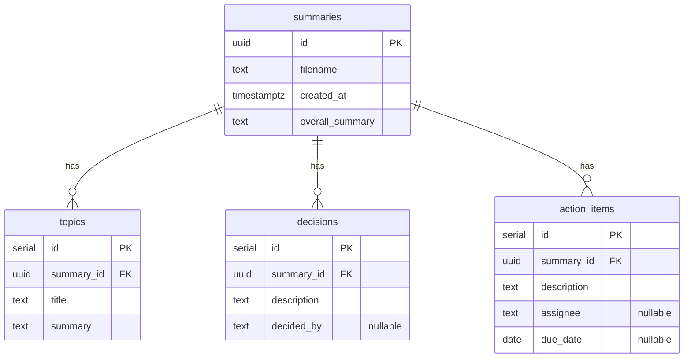

# DB Design

## ER Diagram



## 設計メモ

### `due_date` の型

`action_items.due_date` は `date` 型。LLM プロンプトで ISO 8601 形式 (YYYY-MM-DD) を強制し、確定日が不明なら `null` を返させる。

「来週月曜」のような相対表現や非 ISO 形式が返ってきた場合は、Pydantic の `field_validator` で `None` に fallback する (`app/llm/summarize/schema.py` 参照)。これにより、1件の日付パース失敗で Summary 全体がロールバックする事態を防ぐ。

### CASCADE 削除

`topics` / `decisions` / `action_items` の `summary_id` FK に `ON DELETE CASCADE` を設定。`summaries` のレコードを削除すると子レコードも自動削除される。

### `created_at` のデフォルト

`default=datetime.now(UTC)` はモジュールロード時に一度だけ評価されるため、全レコードが同じ日時になるバグがある。以下に修正が必要。

```python
created_at: datetime = Field(default_factory=lambda: datetime.now(UTC))
```
